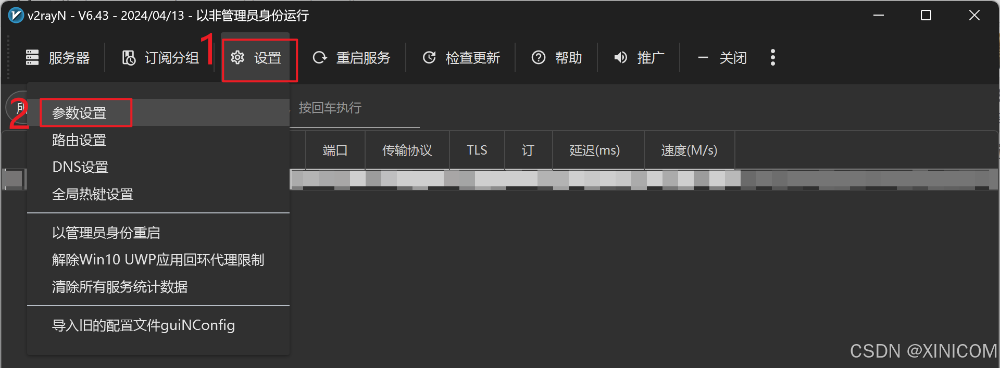
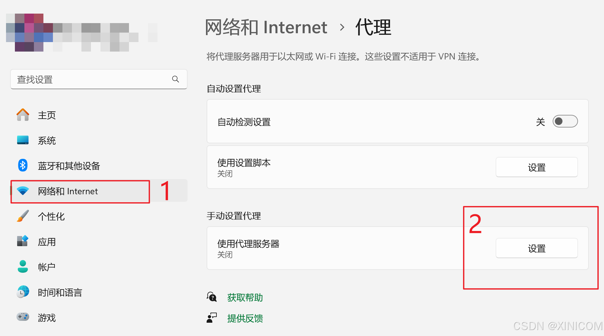
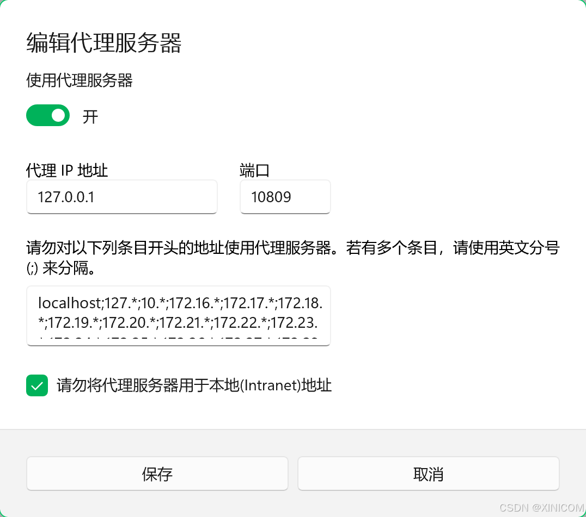

> [!note] 开发环境
> VS 版本：VS 2022
> 系统版本：Windows 11

# 前言

本文给出，本人在使用 VS 中内置的 Git 进行源代码管理将库推送至 Github 时遇见的问题，和对应解决方法。

本文适用可能仅适用 VS 2022 自带的 Git 进行版本管理的开发者。

# 解决方法

## 原因

一般是因为请求超时导致，及 Git 没有使用你用的代理来推送。

## 解决

1. 确认你用的代理，这里我用了 v2rayN
   
   
   可见我用的端口是 10808，同时确保 v2rayN 使用 `自动配置系统代理`

2. 系统代理设置
   
   
   我看着 v2rayN 上面写 http 端口为 `socks + 1` ，故这里写 10809。（如果不这么写能不能成功不确定）

3. 配置 Git

    因为 VS2022 自带 Git，故而要去找到 Git.exe 的文件夹，一般为 `C:\Program Files\Microsoft Visual Studio\2022\Community\Common7\IDE\CommonExtensions\Microsoft\TeamFoundation\Team Explorer\Git\cmd` 中，在此文件夹打开 `PowerShell` ：

    ```ps1 | lang:PowerShell
    git config --global http.proxy "socks5://127.0.0.1:10808"
    git config --global https.proxy "socks5://127.0.0.1:10808"
    ```

    > [!note]
    > ​由于 v2rayN 是走 socks5 代理的，且我的端口是 10808 故如上；若是其他代理可以参考 [GIT Proxy 一键设置代理让你的 git clone Github 再也不像百度云一样内行](https://blog.csdn.net/HD243608836/article/details/127869482)

    ​之后检查配置是否成功：

    ```ps1 | lang:PowerShell
    git config --global -l
    ```

    应该有如下的项目：

    ```ps1 | lang:PowerShell
    http.proxy=socks5://127.0.0.1:10808
    https.proxy=socks5://127.0.0.1:10808
    ```

    > [!tip] 可能面临的报错
    >
    > ```ps1 | lang:PowerShell
    > error: cannot spawn more: No such file or directory
    > error: cannot spawn less: No such file or directory
    > ```
    >
    > 解决方法是输入：
    >
    > ```ps1 | lang:PowerShell
    > git config --global core.pager ''
    > ```

    > [!warning]
    > 参考 [Git 报错 error: cannot spawn more: No such file or directory](https://www.cnblogs.com/outsrkem/p/14403449.html)
    >
    > 上述的解决方法可能治标不治本

    就此应该可以正常推送了。

# 补充

若出现 `Failed to connect to 127.0.0.1 port 7890 after 2021 ms: Couldn‘t connect to server` 等类似报错，说明代理设置不正确。

若仍有问题无法解决可以参考以下文章：
[github desktop 报 error: cannot spawn xxx: No such file or directory 的解决方法](https://blog.csdn.net/weixin_40920751/article/details/121970779)
​
