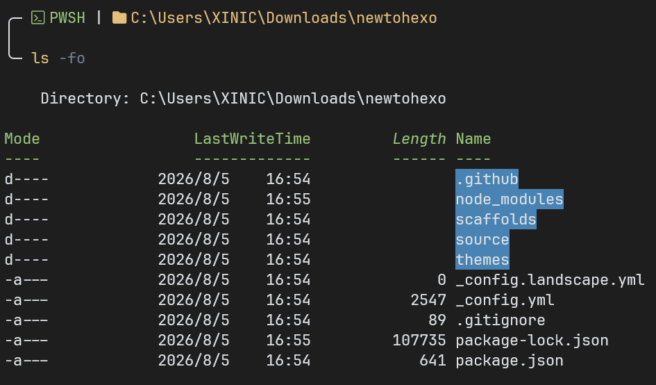
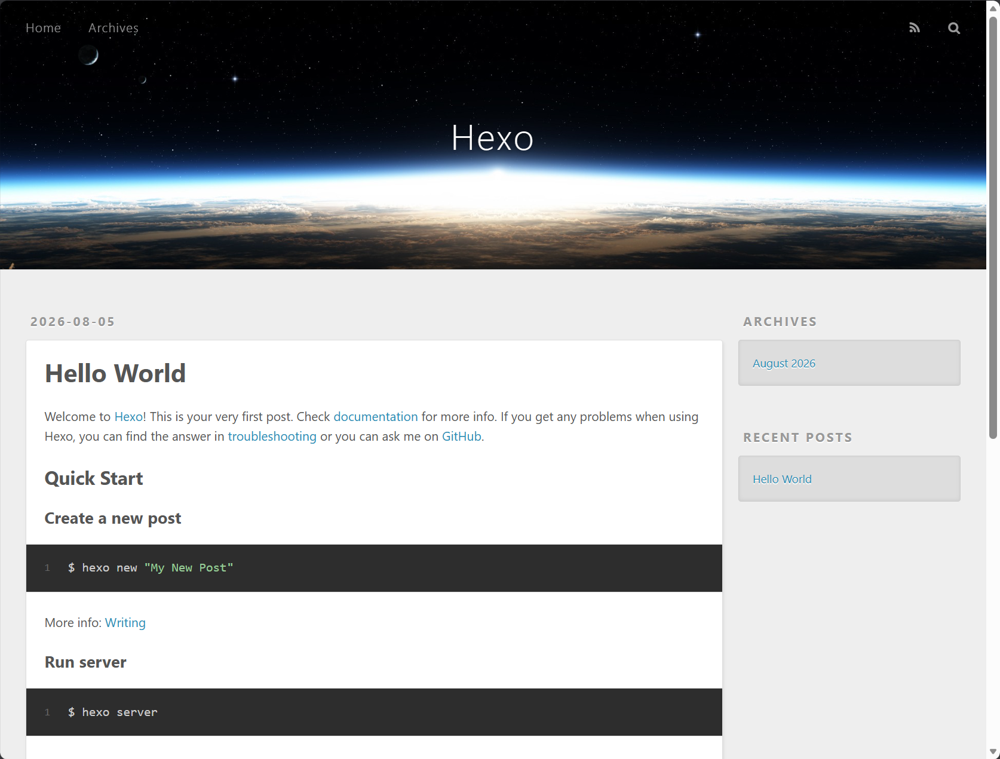

# 简介

本章节先进行 Windows 下 Hexo 的下载和简单的 Hexo 介绍

# 安装

你可以参照 [Hexo 官方文档](https://hexo.io/zh-cn/docs/) 来部署，也可以看下方我总结的步骤：

1. 安装 Hexo 的运行环境 Node.js
   在 [Node.js 下载页面](https://nodejs.org/zh-cn/download) 上下载 Node.js
   注意 `npm package manager` 和 `Add to PATH` 要确保勾选

    可以运行以下命令确定 Node.js 和 npm 是否正常安装：

    ```ps1 | lang:PowerShell
    node -v # v24.17.0
    npm -v # 11.18.0
    ```

> [!note]
> 因为我是用 PowerShell 的，故而上面所写的语言为 PowerShell (ps1)，
> 但是不管你用哪个 Shell 都可以，因为 PowerShell 兼容 cmd

2. 安装 [Git](https://git-scm.com/install/windows) 来 Clone Hexo init 项目，和进行后续的版本管理
   可以运行以下命令确定 Git 是否正常安装：

    ```ps1 | lang:PowerShell
    git -v # git version 2.53.0.windows.3
    ```

3. 安装 Hexo 组件

    ```ps1 | lang:PowerShell
    npm install -g hexo-cli
    ```

    这一步仅仅只是安装了 Hexo 的组件，你依旧无法直接使用 Hexo

4. 初始化博客文件夹
    - 我在 `~\Downloads\` 下运行：

        ```ps1 | lang:PowerShell
        hexo init newtohexo
        ```

        这会创建 `~\Downloads\newtohexo\` 文件夹，并且在其中进行初始化

    - 你也可以先行创建 `~\Downloads\newtohexo\` 文件夹，然后在该文件夹下使用 `hexo init` 来初始化

5. 进入 `~\Downloads\newtohexo\` 文件夹，
   你应该可以看到如下文件：
   

6. 安装 npm 包：

    ```ps1 | lang:PowerShell
    npm install

    # added 1 package, and audited 244 packages in 2s
    #
    # 41 packages are looking for funding
    #   run `npm fund` for details
    #
    # found 0 vulnerabilities
    # npm warn allow-scripts 4 packages have install scripts not yet covered by allowScripts:
    # npm warn allow-scripts   hexo-util@3.3.0 (postinstall: npm run build:highlight)
    # npm warn allow-scripts   hexo-util@3.3.0 (postinstall: npm run build:highlight)
    # npm warn allow-scripts   hexo-util@3.3.0 (postinstall: npm run build:highlight)
    # npm warn allow-scripts   hexo-util@4.0.0 (postinstall: npm run build:highlight)
    # npm warn allow-scripts
    # npm warn allow-scripts Run `npm install-scripts ls` to review, or `npm install-scripts approve <pkg>` to allow.
    ```

7. 测试 Hexo 服务：

    ```ps1 | lang:PowerShell
    hexo clean ; hexo server

    # INFO  Validating config
    # INFO  Deleted database.
    # INFO  Validating config
    # INFO  Start processing
    # INFO  Hexo is running at http://localhost:4000/ . Press Ctrl+C to stop.
    ```

    你应该可以看见：

    

## 直接使用 XNCst 主题

你也可以选择使用我的博客的主题 XNCst

直接克隆
